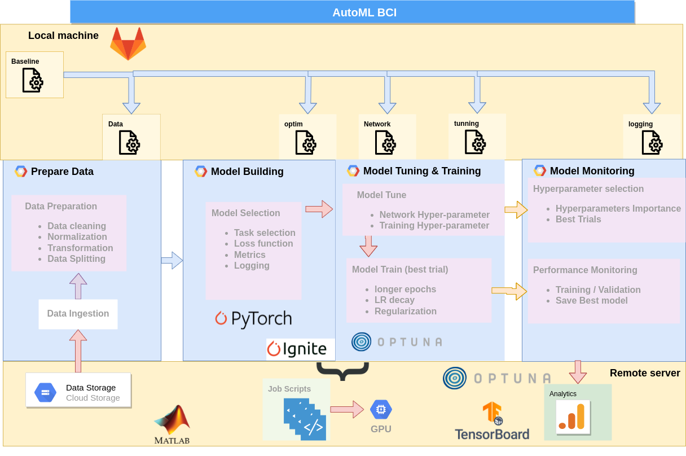

<!--
*** Thanks for checking out the Best-README-Template. If you have a suggestion
*** that would make this better, please fork the repo and create a pull request
*** or simply open an issue with the tag "enhancement".
*** Thanks again! Now go create something AMAZING! :D
-->


<!-- PROJECT SHIELDS -->
<!--
*** I'm using markdown "reference style" links for readability.
*** Reference links are enclosed in brackets [ ] instead of parentheses ( ).
*** See the bottom of this document for the declaration of the reference variables
*** for contributors-url, forks-url, etc. This is an optional, concise syntax you may use.
*** https://www.markdownguide.org/basic-syntax/#reference-style-links
-->


<!-- PROJECT LOGO -->
# AutoML BCI


<!-- TABLE OF CONTENTS -->
<details open="open">
  <summary>Table of Contents</summary>
  <ol>
    <li>
      <a href="#about-the-project">About The Project</a>
      <ul>
        <li><a href="#built-with">Built With</a></li>
      </ul>
      <ul>
        <li><a href="#Prerequisites">Prerequisites</a></li>
      </ul>
    </li>
    </li>
    <li><a href="#contributing">Contributing</a></li>
    <li><a href="#contact">Contact</a></li>
    <li><a href="#acknowledgements">Acknowledgements</a></li>
  </ol>
</details>


<!-- ABOUT THE PROJECT -->
## About The Project
AutoML BCI is a framework to train neural network dedicated for BCI Problem. it supports hyperparameters tunning using **Optuna** framework, and enables live tracking and model monitoring via **Tensorbaord**.

This framework adapts the MLOps design concept, which supports continous intergation and continous training. It is composed of three main building blocks, as illustrated in the below diagram. The building blocks of AutoML BCI are controlled by configuration files, which helps to minimizes  changes in the core code, eases and simplifies the usage of the framework and most importantly allows launching multiple and parallel experiments without losing track of the parameters records.




### Built With
AutoML BCI framework is build with help of the following frameworks: 
* [Pytorch](https://pytorch.org/)
* [Optuna](https://optuna.org/)
* [Tensorboard](https://www.tensorflow.org/tensorboard)
* [Ignite](https://pytorch.org/ignite/index.html)
### Prerequisites
#### Dataset BBCI
Database InformationThis database includes the de-identified EEG data from 62 healthy individuals who participated in a brain-computer interface (BCI) study
https://figshare.com/articles/dataset/Human_EEG_Dataset_for_Brain-Computer_Interface_and_Meditation/13123148
* how to download Dataset BBCI(351GB)
  mkdir -p ~/data
  wget https://figshare.com/ndownloader/articles/13123148/versions/1
  unzip 1

how to install miniconda3 
* how to install miniconda3
  ```sh
  mkdir -p ~/miniconda3
  wget https://repo.anaconda.com/miniconda/Miniconda3-latest-Linux-x86_64.sh -O ~/miniconda3/miniconda.sh
  bash ~/miniconda3/miniconda.sh -b -u -p ~/miniconda3
  rm -rf ~/miniconda3/miniconda.sh
  ~/miniconda3/bin/conda init bash
  ~/miniconda3/bin/conda init zsh
  echo "PATH=$PATH:$HOME/miniconda3/bin" >> .bashrc
  source .bashrc
  ```
* how to install environment 
  ```sh
  conda env create -f cluster_env.yaml 
  ```
* how to install environment and Create conda environment from environment.yaml (environment_windows.yaml for Windows OS)
  ```sh
  conda env create -f environment.yaml
  ```
Then make sure your IDE is running on this environment.
In PyCharm one has to click on Python 3.7, add an interpreter and then add an existing conda environment.
1. Clone the repo
   ```sh
   git clone git@git.tu-berlin.de:roydick1.0/BCI-PJ2021SS.git
   ```
2. activate conda enviroment
   ```sh
   source .bashrc
   conda activate bbcpy_env
   ```
3. Install missing libraries
   ```sh
   pip3 install ...
   ```

<!-- CONTRIBUTING -->
## Contributing

Contributions are what make the open source community such an amazing place to be learn, inspire, and create. Any contributions you make are **greatly appreciated**.

1. Fork the Project
2. Create your Feature Branch (`git checkout -b feature/AmazingFeature`)
3. Commit your Changes (`git commit -m 'Add some AmazingFeature'`)
4. Push to the Branch (`git push origin feature/AmazingFeature`)
5. Open a Pull Request


<!-- CONTACT -->
## Contact

* **Ali Alouane** (ali.alouane@campus.tu-berlin.de)
* **Jana-Kira SchomberPiet** 
* **Piet Lennart Wagner** 
* **Philip Daniel Wilson** 

<!-- ACKNOWLEDGEMENTS -->
## Acknowledgements

We want to give many thanks to our project supervisor **Dr. Daniel Miklody**, **Oleksandr Zlatov**, and the Neurotechnology group at TU Berlin.


